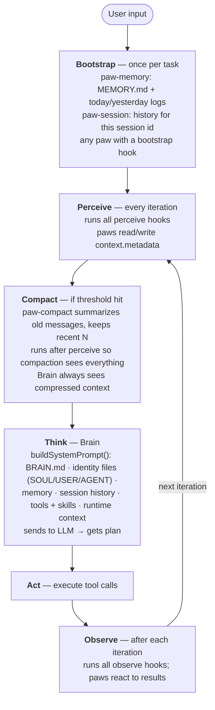

# Context Management

How OpenVole builds, enriches, and compresses the context that the Brain sees on every iteration.

## Pluggable by Design

The core defines **when** each phase runs — the **how** is implemented by Paws. Every phase in the pipeline is handled by a Paw that you can replace with your own implementation:

| Phase | Default Paw | What you can replace it with |
|-------|-------------|------------------------------|
| Memory | `paw-memory` (BM25 file search) | Vector database, RAG pipeline, external knowledge base |
| Session | `paw-session` (file-based transcripts) | Redis, database-backed sessions, shared sessions |
| Compaction | `paw-compact` (rule-based extraction) | LLM-based summarization, lossless DAG, sliding window |
| Brain | `paw-brain` (unified multi-provider) | Any LLM provider, custom inference, local models |

Install your custom paw, add it to `vole.config.json`, and the core uses it — no core changes needed. This is the microkernel approach: the core provides the lifecycle, paws provide the behavior.

## Context Flow



## How Paws Inject Context

Any paw can enrich the Brain's context by registering hooks and writing to `context.metadata`.

### Bootstrap Hook (once per task)

Runs once when a task starts. Use for loading persistent data.

```typescript
async function onBootstrap(context) {
  const data = await loadMyData()
  context.metadata.myCustomData = data
}
```

### Perceive Hook (every iteration)

Runs before every `think()` call. Use for dynamic context that changes per iteration.

```typescript
async function onPerceive(context) {
  context.metadata.currentWeather = await fetchWeather()
}
```

### Observe Hook (after each iteration)

Runs after `think()` + `act()`. Use for recording results.

```typescript
async function onObserve(context) {
  await saveToTranscript(context.messages)
}
```

## What the Brain Sees

The Brain receives a single system prompt assembled from:

1. **BRAIN.md** — the base prompt (from `.openvole/paws/<brain>/BRAIN.md`)
2. **Runtime context** — current date, time, platform, model name
3. **Identity files** — SOUL.md, USER.md, AGENT.md (personality, user profile, rules)
4. **Session history** — previous messages from this session (from `context.metadata.sessionHistory`)
5. **Memory** — relevant memory entries (from `context.metadata.memory`)
6. **Active skills** — compact list of available skills with descriptions
7. **Available tools** — all registered tools with parameter schemas
8. **Custom metadata** — anything paws injected via hooks into `context.metadata`

The Brain doesn't know where this context came from. It just sees a prompt, tools, and messages.

## Compaction

When the message history exceeds `compactThreshold` (configurable in `vole.config.json`), the compact hook fires after perceive and before think — so the Brain always sees compressed context.

### Current: Rule-Based (paw-compact)

- Extracts key information from old messages (tool calls, results, responses, errors)
- Replaces middle messages with a structured summary
- Keeps first message (original input) + recent N messages (default 10) verbatim
- No LLM needed — pure extraction
- Fast and free

### Future: Lossless Compaction (roadmap)

Incremental LLM-based summarization with full recall — similar to OpenClaw's lossless-claw approach:

- Raw messages persisted to storage
- LLM summarizes chunks into hierarchical summary nodes (DAG)
- Summaries are themselves summarized into higher-level nodes
- Agent can expand any summary to recover original messages
- No information loss — compressed for context window, recoverable on demand

This would be a separate paw (e.g. `paw-compact-lossless`) that replaces `paw-compact` — the compact hook interface stays the same.

## Memory Search

`paw-memory` provides BM25 ranked search over memory files:

- Daily logs scoped by source (user, paw, heartbeat)
- MEMORY.md for persistent facts
- `memory_search` returns results ranked by relevance score

## Adding Your Own Context

To build a paw that injects custom context:

1. Register a `bootstrap` or `perceive` hook in your paw
2. Write data to `context.metadata.yourKey`
3. The Brain paw reads metadata and includes it in the system prompt

No core changes needed — this is how paw-memory and paw-session work.
