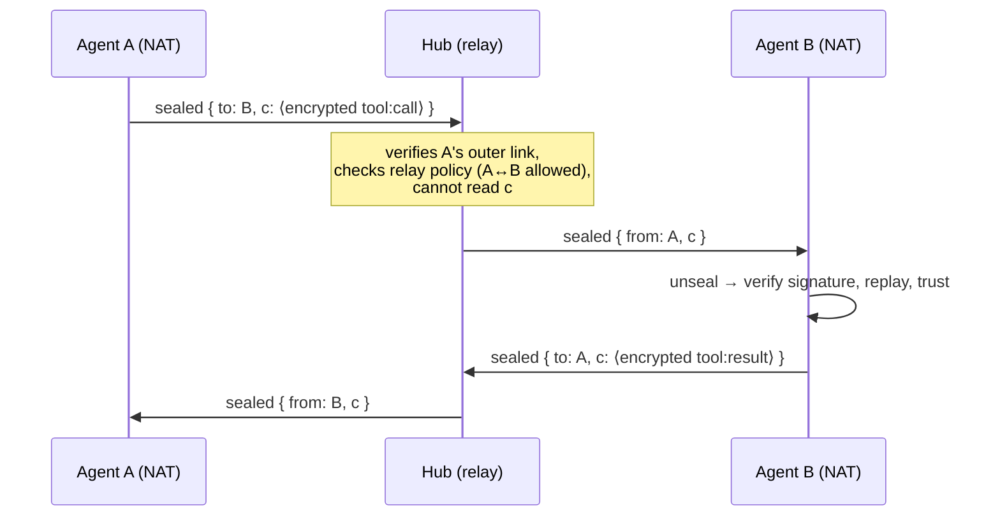

# VoleNet Relay — design draft

Status: **draft, pre-implementation.** This documents the protocol work that makes a hosted hub able
to connect agents that cannot reach each other directly — without being able to read what it carries.

## The problem

VoleNet transport is dial-by-endpoint (WebSocket/HTTP over TCP). Two agents behind home/office NAT
both advertise unreachable addresses: each can dial **out** to a hub, but neither can dial the other,
and TCP offers no reliable hole-punching. Today the hub also never forwards member↔member traffic —
every relationship is pairwise. So for two NAT'd members, "remote tools become local" needs a relay,
and for the common case the relay is the *default* path, not a rare fallback. That is fine — but only
if the relay cannot read what it relays.

## Design goals

1. **Blind relay.** The hub forwards envelopes it cannot open. It learns metadata only
   (who↔who, sizes, timing) — never tool names, parameters, or results.
2. **No trust downgrade.** Relayed messages keep the existing per-message signatures and
   authorization checks on the *receiving agent*. The relay adds reachability, never authority.
3. **Direct when possible.** If peers can reach each other (same LAN, one has a public endpoint),
   they talk directly, exactly as today. The relay is the path of last resort the protocol upgrades
   away from, per pair, automatically.
4. **Zero joiner ceremony.** Members join a hub once (`vole net join`); relay reachability falls out
   of the connection they already hold.

## 1 — Sealed envelopes (end-to-end encryption)

Messages are currently **signed but not encrypted**; TLS protects each hop, then the hub sees
plaintext. Sealing fixes that:

- Each instance generates an **X25519 key agreement keypair** alongside its Ed25519 identity. The
  public half is announced in the trust string / discovery payload, **signed by the Ed25519 identity**
  (same pattern the ML-DSA key upgrade uses today), so it inherits the existing trust bootstrap.
- Sender derives a pairwise key (X25519 ECDH → HKDF), encrypts the full VoleNet message with
  XChaCha20-Poly1305, and wraps it:

```jsonc
{
  "type": "sealed",
  "to": "<recipient instanceId>",     // routing — the only field the relay needs
  "from": "<sender instanceId>",
  "n": "<nonce>",
  "c": "<ciphertext of the ordinary signed VoleNet message>"
}
```

- The recipient decrypts, then verifies the inner message exactly as if it had arrived directly:
  signature, replay window, authorization, trust level. **Sealing wraps the existing protocol; it
  does not replace any of its checks.**
- Post-quantum: pair X25519 with **ML-KEM-768** (hybrid KEM) the same zero-touch way Ed25519 was
  paired with ML-DSA-65 — announced, signed, auto-upgraded on reconnect.

Sealing is worth shipping even without a relay: it upgrades every direct VoleNet link from
signed-plaintext to signed-and-encrypted, closing the documented eavesdropping caveat.

## 2 — Relay forwarding

The hub already holds one authenticated WebSocket per member, bound to a verified `instanceId`
(that binding is what reverse delivery uses today). Forwarding reuses it:



- **Policy, not plumbing:** the hub forwards only between members whose pairing its operator allows
  (default: members of the same mesh). Rate limits and size caps per pair; drop-and-count on breach.
- **No store-and-forward** in v1: if the recipient's socket is down, the relay returns
  `peer-unreachable` to the sender — same failure the sender would see on a dead direct link.
- Requires no change on the *sending* agent beyond routing: a peer whose endpoint is unreachable but
  who shares a hub gets `via: <hubId>` in its peer record; `sendToPeer` seals and sends to the hub.

## 3 — Direct upgrade

Discovery already exchanges endpoints. Pairs periodically retry the direct path; on the first
successful signed round-trip, traffic moves off the relay for that pair (and falls back on failure).
Relay minutes become the metric that trends toward zero for reachable pairs — which is the honest
version of "we sell coordination, not bandwidth."

## 4 — Invites

`publicJoin` already covers open registration with an approval queue. Team meshes want closed,
one-shot invites instead:

- The hub operator mints `{ meshId, trustLevel, expiry, nonce }`, **signed by the hub's identity**.
- `vole net join <hub-url> --invite <token>` presents it; the hub verifies its own signature,
  trusts the joiner's key at the embedded trust level, and burns the nonce (single use).
- No shared secrets in chat logs: the token grants one join at one trust level and then is dead.

## Threat model summary

| Party | Sees | Cannot |
|---|---|---|
| Hub / relay | membership, connection times, envelope sizes, who↔who | read tool names, params, results, memory; forge messages (inner signatures); replay (inner windows) |
| Member (guest trust) | tools the mesh chose to share with it | exceed its trust level; impersonate another member (verified caller identity) |
| Network observer | TLS-wrapped traffic to the hub | anything, including metadata beyond IP-level |

Open questions tracked for the implementation pass: nonce/session lifetimes for pairwise keys,
sealed-envelope size overhead on the 1 MB message cap, whether relay policy belongs in
`vole.config.json` or hub-side storage, and metadata minimization (padding, batching) for the
relay's who↔who visibility.
