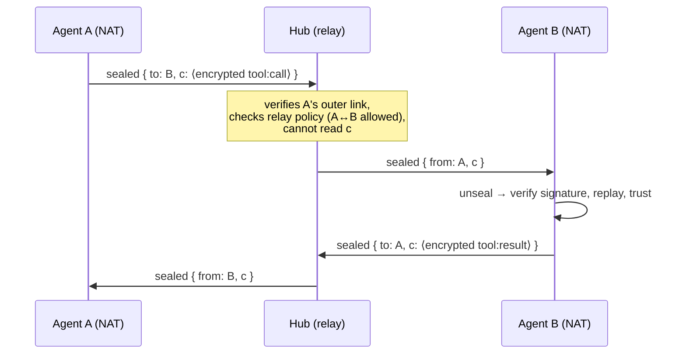
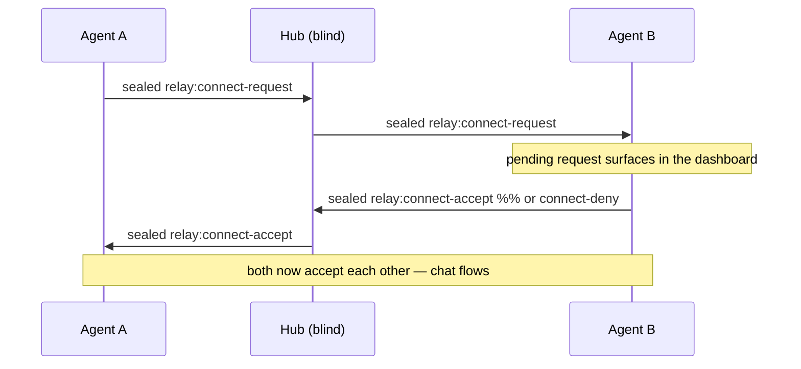

# VoleNet Relay — design draft

Status: **v1 shipped in openvole 4.10.0**, **connection consent added in 4.11.0**, **post-quantum
hybrid seal + direct-mesh encryption added in 4.12.0** — sealed envelopes (§1), relay forwarding
(§2), connection consent (§2.5), and the member roster are implemented; what rides the relay is
**end-to-end encrypted chat only**. Direct upgrade (§3) and invites (§4) remain design drafts.
Enable on a hub with:

```jsonc
// hub — forward sealed envelopes between members
"net": { "relay": { "enabled": true, "maxPerMinutePerPair": 30, "maxBytes": 65536 } }

// member — who may reach you over a relay (default: only peers you approve or already trust)
"net": { "relay": { "acceptFrom": "*" } }   // "*" = any hub member (open community hub)
```

Members need nothing to be *reachable*: the hub pushes a member roster (identities + sealing keys —
directory data, never authority), and chat to an unreachable member automatically seals and routes
via the hub. But **sharing a hub is not consent** (§2.5): a member's chat is held until the
recipient accepts it. Nothing executable rides the relay: a sealed `tool:call` is dropped by the
recipient. This documents the protocol that makes a hosted hub able to connect agents that cannot
reach each other directly — without being able to read what it carries.

## The problem

VoleNet transport is dial-by-endpoint (WebSocket/HTTP over TCP). Two agents behind home/office NAT
both advertise unreachable addresses: each can dial **out** to a hub, but neither can dial the other,
and TCP offers no reliable hole-punching. Today the hub also never forwards member↔member traffic —
every relationship is pairwise. So for two NAT'd members, "remote tools become local" needs a relay,
and for the common case the relay is the *default* path, not a rare fallback. That is fine — but only
if the relay cannot read what it relays.

## Design goals

1. **Blind relay.** The hub forwards envelopes it cannot open. It learns metadata only
   (who↔who, sizes, timing) — never tool names, parameters, or results.
2. **No trust downgrade.** Relayed messages keep the existing per-message signatures and
   authorization checks on the *receiving agent*. The relay adds reachability, never authority.
3. **Direct when possible.** If peers can reach each other (same LAN, one has a public endpoint),
   they talk directly, exactly as today. The relay is the path of last resort the protocol upgrades
   away from, per pair, automatically.
4. **Zero joiner ceremony.** Members join a hub once (`vole net join`); relay reachability falls out
   of the connection they already hold.

## 1 — Sealed envelopes (post-quantum hybrid, relay + direct)

Direct VoleNet messages are **signed** — TLS optionally protects each hop, then the receiving host
sees plaintext. Sealing adds application-layer confidentiality that doesn't depend on TLS: the relay
path is always sealed (shipped 4.10.0), and every *direct* link can be too (`net.encrypt: true`,
shipped 4.12.0).

- Each instance generates an **X25519 key-agreement keypair** and an **ML-KEM-768** encapsulation
  keypair alongside its Ed25519 identity. Both public halves are announced in the discovery payload,
  **signed by the Ed25519 identity** (same pattern the ML-DSA upgrade uses), so they inherit the
  existing trust bootstrap; existing keypairs auto-upgrade on load.
- The seal is a **hybrid KEM**: a fresh **ephemeral X25519** ECDH shared secret is concatenated with
  an **ML-KEM-768** encapsulated shared secret, HKDF-SHA256 derives the key, and **ChaCha20-Poly1305**
  encrypts the full VoleNet message — the AAD binding the envelope to its `from|to` routing:

```jsonc
{
  "type": "sealed",                    // (relay) or "sealed:direct" (direct) — a signed message wrapping:
  "payload": {
    "to": "<recipient instanceId>",    // routing — relay only; sealed:direct is addressed by transport
    "box": {
      "epk": "<ephemeral X25519 pub>",
      "kem": "<ML-KEM-768 ciphertext>",  // omitted when the peer has no PQ key (X25519-only fallback)
      "n": "<nonce>", "c": "<ciphertext ‖ tag>"
    }
  }
}
```

- Confidentiality holds unless **both** the classical (X25519) and post-quantum (ML-KEM) KEMs are
  broken — defeating harvest-now-decrypt-later. The scheme is bound into the KDF, so stripping the
  KEM ciphertext yields a wrong key and fails the tag; a downgrade can drop a message, never weaken it.
- The recipient decrypts, then verifies the inner message exactly as if it had arrived directly:
  signature, replay window, authorization, trust level. **Sealing wraps the existing protocol; it
  does not replace any of its checks.** For `sealed:direct`, the recovered inner message is re-injected
  into the normal receive pipeline, so all message types (tool calls, sync, chat) ride it transparently.
- **Opportunistic**: a peer that announces no ML-KEM key (older version) receives an X25519-only seal
  or plaintext, so a mixed-version mesh keeps working. Direct encryption is opt-in per node.

## 2 — Relay forwarding

The hub already holds one authenticated WebSocket per member, bound to a verified `instanceId`
(that binding is what reverse delivery uses today). Forwarding reuses it:



- **Policy, not plumbing:** the hub forwards only between members whose pairing its operator allows
  (default: members of the same mesh). Rate limits and size caps per pair; drop-and-count on breach.
- **No store-and-forward** in v1: if the recipient's socket is down, the relay returns
  `peer-unreachable` to the sender — same failure the sender would see on a dead direct link.
- Requires no change on the *sending* agent beyond routing: a peer whose endpoint is unreachable but
  who shares a hub gets `via: <hubId>` in its peer record; `sendToPeer` seals and sends to the hub.

## 2.5 — Connection consent (shipped 4.11.0)

Forwarding makes two members *reachable*; it does not make them *connected*. Co-membership on a hub
is not a relationship — the same way being on the same LAN or ISP isn't. A member's relayed chat is
**dropped until the recipient has consented to that sender**; the recipient instead sees a pending
connect-request. Consent reuses VoleNet's existing trust primitive rather than inventing a parallel
one: if you'd accept a peer's *direct* connection, the relay isn't a new grant; otherwise it's denied
by default.

**Recipient policy — `net.relay.acceptFrom`** (evaluated on the receiving agent, so the hub never
arbitrates trust):

| Value | Meaning |
|---|---|
| *unset* (default) | Accept only peers you've explicitly approved (below) or already directly trust. |
| `"*"` | Accept any hub member — the open community-hub shape (set this on the club). |
| `["name", "id-prefix", …]` | Static allowlist by member name or `instanceId` prefix. |

**Handshake** (all sealed end-to-end — the hub sees only ciphertext + `from|to` routing):



- On request, the initiator consents to the target (so the reply is accepted). On approval, the
  recipient consents to the initiator — the pair is mutual and chat flows both ways.
- Approvals persist to `.openvole/net/relay_accepts`, pinning the peer's roster-vouched key, so they
  survive restarts and a later key-swap by a malicious hub can't ride an old approval.
- Enforcement is recipient-side, which keeps the hub blind. An unaccepted sender's chat is held (not
  bounced), surfacing as a request; a directly-trusted peer skips the handshake entirely.

## 3 — Direct upgrade

Discovery already exchanges endpoints. Pairs periodically retry the direct path; on the first
successful signed round-trip, traffic moves off the relay for that pair (and falls back on failure).
Relay minutes become the metric that trends toward zero for reachable pairs — which is the honest
version of "we sell coordination, not bandwidth."

## 4 — Invites

`publicJoin` already covers open registration with an approval queue. Team meshes want closed,
one-shot invites instead:

- The hub operator mints `{ meshId, trustLevel, expiry, nonce }`, **signed by the hub's identity**.
- `vole net join <hub-url> --invite <token>` presents it; the hub verifies its own signature,
  trusts the joiner's key at the embedded trust level, and burns the nonce (single use).
- No shared secrets in chat logs: the token grants one join at one trust level and then is dead.

## Threat model summary

| Party | Sees | Cannot |
|---|---|---|
| Hub / relay | membership, connection times, envelope sizes, who↔who | read tool names, params, results, memory; forge messages (inner signatures); replay (inner windows); grant member↔member contact (consent is recipient-side, §2.5) |
| Member (guest trust) | tools the mesh chose to share with it | exceed its trust level; impersonate another member (verified caller identity); reach a member that hasn't accepted it (§2.5) |
| Network observer | ciphertext (sealed traffic) or TLS-wrapped bytes; envelope sizes | read sealed content, even by recording it for a future quantum computer (hybrid X25519 + ML-KEM-768) |

Relay contact policy lives in `vole.config.json` on the *receiving* agent (`net.relay.acceptFrom`)
plus its `.openvole/net/relay_accepts` approval store — deliberately member-side so the blind hub
never arbitrates who may talk to whom. Direct-link confidentiality is opt-in per node
(`net.encrypt`); the relay path is always sealed.

Open questions tracked for the implementation pass: **per-message ML-KEM encapsulation is fine at
mesh scale but wants a per-peer session key / ratchet for high-volume direct traffic** (the
"nonce/session lifetimes for pairwise keys" item); sealed-envelope size overhead (a hybrid box adds
~1.5 KB) on the 1 MB message cap; roster minimization (a hub still broadcasts its full membership for
discovery — an enumeration surface to close for public hubs); and metadata minimization (padding,
batching) for the relay's who↔who visibility.
