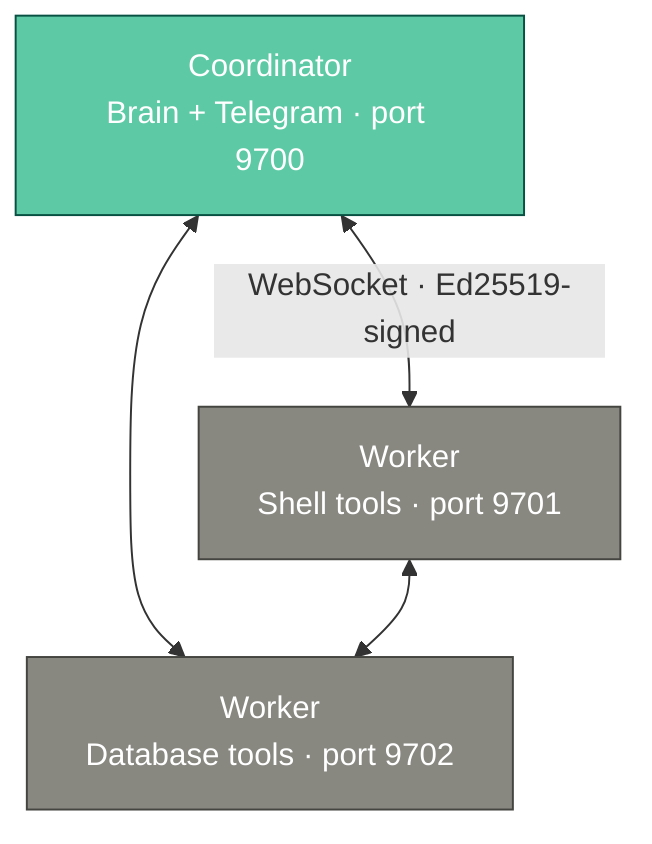
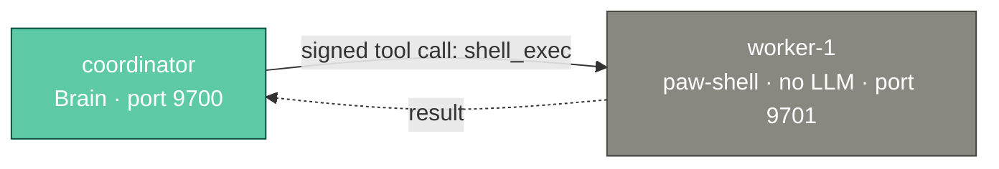
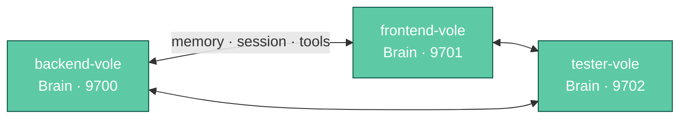
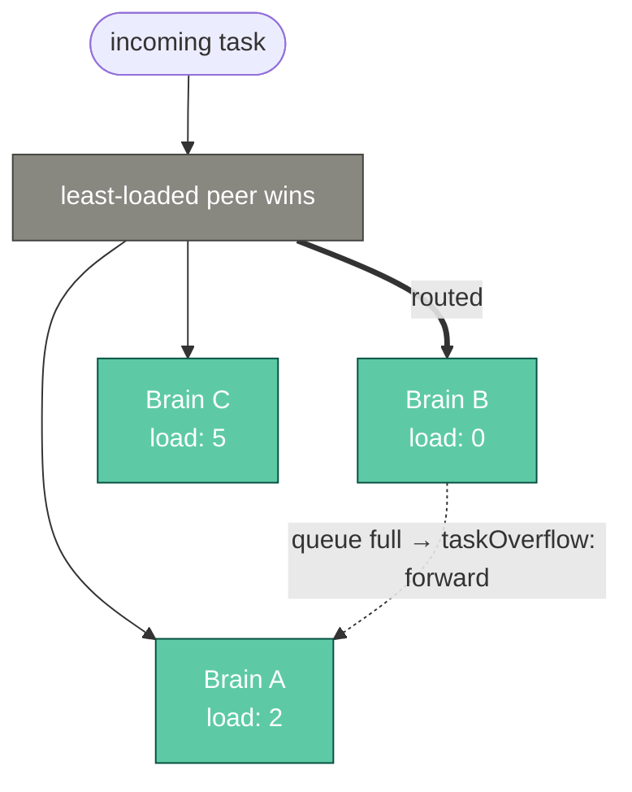
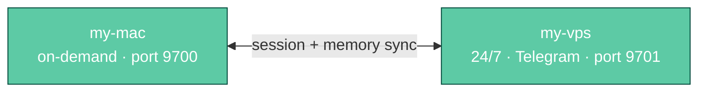
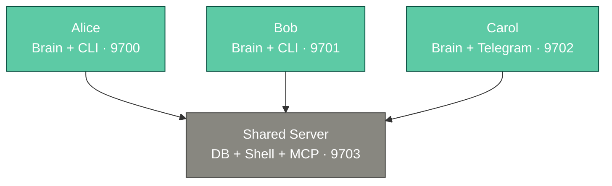
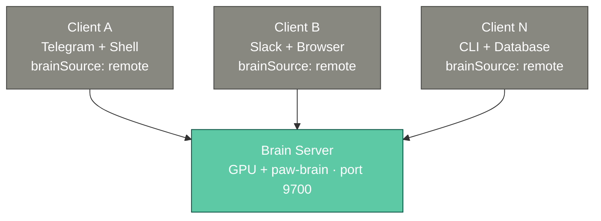
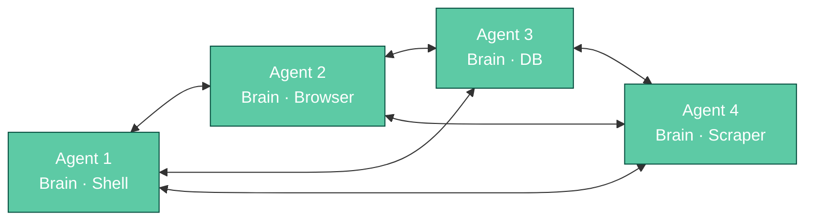
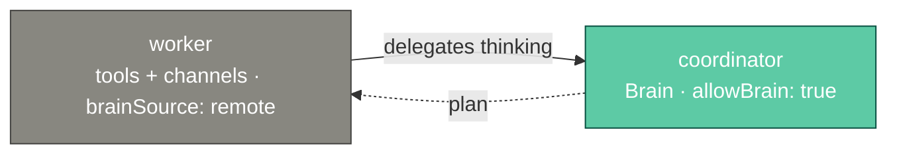

# VoleNet

VoleNet is OpenVole's distributed agent networking layer. It connects multiple OpenVole instances across machines, enabling remote tool execution, node-to-node messaging, memory synchronization, brain sharing, and leader election — every remote action authenticated and authorized per message with Ed25519 signatures.

> [!NOTE]
> A design draft extends VoleNet beyond what ships today: the [blind relay](/volenet-relay)
> — sealed envelopes a hosted hub cannot read. Draft means: specified, public, in development.

## How It Works



1. Each instance generates an Ed25519 keypair (`vole net init`)
2. Instances exchange public keys to establish trust (`vole net trust`)
3. On startup, peers connect via WebSocket and discover each other's tools
4. Remote tools appear in the coordinator's tool registry — the Brain calls them like local tools
5. All messages are signed with Ed25519 and include replay protection (60s window)
6. Configured peers are re-attempted every ~15s, so the mesh self-heals from start-order races, late joiners, and transient drops

## Architecture Patterns

### Pattern 1: Single Brain, Distributed Tools

One coordinator runs the Brain. Workers expose tools (shell, database, etc.) without needing their own LLM.



```json
// coordinator
{
  "brain": "@openvole/paw-brain",
  "net": {
    "enabled": true, "instanceName": "coordinator", "role": "coordinator", "port": 9700,
    "peers": [
      { "url": "http://worker-1:9701", "trust": "full" }
    ],
    "share": { "tools": false, "memory": true }
  }
}

// worker (no brain)
{
  "paws": [
    { "name": "@openvole/paw-shell", "allow": { "childProcess": true, "filesystem": ["./"] } }
  ],
  "net": {
    "enabled": true, "instanceName": "worker-1", "role": "worker", "port": 9701,
    "peers": [{ "url": "http://coordinator:9700", "trust": "full" }],
    "share": { "tools": true, "memory": false }
  }
}
```

> [!TIP]
> **Sharing with strangers?** On a hub with `publicJoin` enabled, `share.tools: true` exposes *every* tool to joined peers. Add `"toolAllow": ["club_*"]` (patterns) next to it to advertise and permit only a curated set — explicit per-peer `allowTools`/`denyTools` entries still override. See the [public-hub example](https://github.com/openvole/openvole/tree/main/examples/public-hub) for a Paw Club wired this way.

**Use cases:** DevOps monitoring (run commands on remote servers), distributed scraping, database on a different machine.

### Pattern 2: Multi-Brain Independent

Each instance has its own Brain and heartbeat. Peers can share memory and communicate, but think independently.



```json
{
  "brain": "@openvole/paw-brain",
  "net": {
    "enabled": true, "instanceName": "backend-vole", "role": "peer", "port": 9700,
    "peers": [
      { "url": "http://localhost:9701", "trust": "full" },
      { "url": "http://localhost:9702", "trust": "full" }
    ],
    "share": { "tools": true, "memory": true, "session": true }
  }
}
```

**Use cases:** Autonomous dev team (backend + frontend + tester), specialized research agents.

### Pattern 3: Load-Balanced Brains

Multiple instances with Brains. Tasks route to the least-loaded peer.



```json
{
  "net": {
    "brainMode": "loadbalance",
    "taskOverflow": "forward",
    "maxQueuedTasks": 5
  }
}
```

### Pattern 4: Shared Session Multi-Device

Same user, same conversation across devices. Session and memory sync in both directions.



```json
// Mac (on-demand use)
{
  "net": {
    "instanceName": "my-mac", "role": "peer", "port": 9700,
    "peers": [{ "url": "http://vps-ip:9701", "trust": "full" }],
    "share": { "tools": true, "memory": true, "session": true }
  }
}

// VPS (24/7 with Telegram)
{
  "net": {
    "instanceName": "my-vps", "role": "peer", "port": 9701,
    "peers": [{ "url": "http://mac-ip:9700", "trust": "full" }],
    "share": { "tools": true, "memory": true, "session": true }
  }
}
```

### Pattern 5: Multi-User Team

Each team member has their own Brain and tools, but they share a common memory and tool server.



```json
// Alice's instance
{
  "brain": "@openvole/paw-brain",
  "net": {
    "enabled": true, "instanceName": "alice", "role": "peer", "port": 9700,
    "peers": [
      { "url": "http://server:9703", "trust": "full" },
      { "url": "http://bob:9701", "trust": "read" },
      { "url": "http://carol:9702", "trust": "read" }
    ],
    "share": { "tools": false, "memory": true }
  }
}

// Shared server (no brain, exposes tools to all)
{
  "paws": [
    { "name": "@openvole/paw-database", "allow": { "network": ["*"], "filesystem": ["./"] } },
    { "name": "@openvole/paw-shell", "allow": { "childProcess": true, "filesystem": ["./"] } }
  ],
  "net": {
    "enabled": true, "instanceName": "shared-server", "role": "worker", "port": 9703,
    "peers": [
      { "url": "http://alice:9700", "trust": "tool" },
      { "url": "http://bob:9701", "trust": "tool" },
      { "url": "http://carol:9702", "trust": "tool" }
    ],
    "share": { "tools": true, "memory": false }
  }
}
```

**Use cases:** Small team sharing a database server, dev team with shared infrastructure, agency with per-client agents.

### Pattern 6: Central Brain Company

One powerful Brain server handles all thinking. Thin worker clients just expose tools and channels — no LLM cost per client.



```json
// Brain server — accepts brain delegation from all clients
{
  "brain": "@openvole/paw-brain",
  "paws": [
    { "name": "@openvole/paw-brain", "allow": { "network": ["*"], "env": ["BRAIN_PROVIDER", "BRAIN_API_KEY", "BRAIN_MODEL"] } },
    { "name": "@openvole/paw-memory", "allow": { "network": ["*"] } }
  ],
  "net": {
    "enabled": true, "instanceName": "brain-server", "role": "coordinator", "port": 9700,
    "peers": [
      { "url": "http://client-a:9701", "trust": "full", "allowBrain": true },
      { "url": "http://client-b:9702", "trust": "full", "allowBrain": true },
      { "url": "http://client-n:9703", "trust": "full", "allowBrain": true }
    ],
    "share": { "tools": false, "memory": true }
  }
}

// Client A — no brain, delegates thinking to brain-server
{
  "paws": [
    { "name": "@openvole/paw-telegram", "allow": { "network": ["*"], "env": ["TELEGRAM_BOT_TOKEN", "TELEGRAM_ALLOW_FROM"] } },
    { "name": "@openvole/paw-shell", "allow": { "childProcess": true, "filesystem": ["./"] } }
  ],
  "net": {
    "enabled": true, "instanceName": "client-a", "role": "worker", "port": 9701,
    "peers": [{ "url": "http://brain-server:9700", "trust": "full" }],
    "share": { "tools": true, "memory": false },
    "brainSource": "remote"
  }
}
```

**Use cases:** Company-wide AI assistant, centralized LLM billing, GPU server with thin clients, managed AI service.

### Pattern 7: Autonomous Swarm

Self-organizing agents with no fixed coordinator. Any peer can lead. Tasks automatically forward to the least-loaded instance.



```json
// Every agent has the same net structure (different instanceName/port)
{
  "brain": "@openvole/paw-brain",
  "net": {
    "enabled": true, "instanceName": "agent-1", "role": "peer", "port": 9700,
    "peers": [
      { "url": "http://agent-2:9701", "trust": "full" },
      { "url": "http://agent-3:9702", "trust": "full" },
      { "url": "http://agent-4:9703", "trust": "full" }
    ],
    "share": { "tools": true, "memory": true, "session": false },
    "leader": "auto",
    "heartbeatMode": "leader",
    "brainMode": "loadbalance",
    "taskOverflow": "forward",
    "maxQueuedTasks": 5
  }
}
```

Key behaviors:
- **Leader election:** Lowest instance ID becomes leader automatically. If it disconnects, the next lowest takes over within 30 seconds.
- **Load balancing:** Incoming tasks route to the peer with the lowest current load.
- **Task overflow:** When a peer's queue is full, tasks automatically forward to another peer.
- **Tool sharing:** Each agent's unique tools are available to all others.

**Use cases:** Resilient autonomous research, parallel task processing, fault-tolerant monitoring across regions.

### Pattern 8: Brain Sharing

Workers without a Brain delegate thinking to a coordinator's Brain.



```json
// coordinator — allows brain sharing
{
  "net": {
    "peers": [
      { "url": "http://worker:9701", "trust": "full", "allowBrain": true }
    ]
  }
}

// worker — delegates thinking to coordinator
{
  "net": {
    "brainSource": "remote"
  }
}
```

**Use cases:** Workers that only need tool execution, not their own LLM reasoning.

## Remote Tool Execution

When a worker shares its tools, they appear in the coordinator's tool registry. The Brain calls them transparently:

```
Brain thinks: "I need to check disk usage on the US server"
  → Brain calls: us-monitor/shell_exec({ command: "df -h" })
  → Core detects remote tool → WebSocket to us-monitor
  → us-monitor executes shell_exec locally
  → Result flows back to coordinator
  → Brain sees the output like any local tool
```

### Peer-Specific Tool Names

When multiple peers share the same tool (e.g. two workers both have `shell_exec`), VoleNet registers them with peer-specific names:

- `us-monitor/shell_exec` — runs on the US server
- `eu-monitor/shell_exec` — runs on the EU server

The Brain sees both and can target the right one. The system prompt tells the Brain which peers have which tools and whether they have a brain.

### Tool Routing

Route tool calls to specific peers by glob pattern without the Brain needing to know:

```json
{
  "net": {
    "routing": {
      "shell_*": "server-worker",
      "db_*": "db-worker",
      "scrape_*": "web-scraper"
    }
  }
}
```

## Node Messaging

Two ways for nodes to talk to each other — one answered by a Brain, one by a human. Both ride the same signed, authorized transport (see [Security](#security)).

### Brain-to-brain — the `net_message` tool

The Brain can message another node and get *its Brain's* reply:

```
net_message({ to: "research-vole", text: "what are you working on?" })
```

The peer receives it framed as a peer message and runs it through its own Brain in a per-peer session, then replies — conversational, unlike the one-shot `spawn_remote_agent`. Use `list_instances` to find reachable peers. Gated by the **receiver's** `allowBrain` (off by default): a node only answers with its Brain for peers it has explicitly granted brain access.

### Human-to-human — the dashboard VoleNet tab

[`vole serve`](/dashboard)'s **VoleNet tab** lists connected peers and lets a **human** chat with another node directly. The message lands in that node's VoleNet tab for a person to answer — the Brain is never invoked, so there's **no LLM cost**. Transcripts persist via paw-session (per-peer `volenet:<peerId>` sessions), capped and pruned by [`net.chatRetention`](/configuration#chat-retention) (default: last 1000/peer, cleared after 90 days idle). Useful for operators of different nodes to talk, or to exercise the mesh for free with the [mock brain](/paws-brain#mock-provider-testing).

## Memory Sync

When `share.memory` is enabled:

- **Write propagation:** Memory writes broadcast to all peers. Each peer stores the entry locally.
- **Search:** `memory_search` queries all peers in parallel, results merge with deduplication.
- **Dedup:** A 5-minute TTL cache prevents echo loops (A writes → B receives → B doesn't re-broadcast).

## Session Sync

When `share.session` is enabled:

- User messages and Brain responses propagate to peers.
- The receiving peer writes entries to its local paw-session transcript.
- Enables shared conversations across devices (Pattern 4).

## Leader Election

One instance is elected leader. The leader runs heartbeat schedules and coordinates work.

| Mode | Description |
|------|-------------|
| `"auto"` (default) | Lowest instance ID wins. Automatic failover on disconnect. |
| `"<instanceName>"` | Force a specific instance as leader. |

- Leader sends heartbeat pings every 10 seconds.
- If 3 consecutive heartbeats are missed, peers trigger re-election.
- `heartbeatMode: "leader"` — only the leader runs heartbeat jobs.
- `heartbeatMode: "independent"` — each instance runs its own heartbeat.

## Trust Levels

`authorized_voles` decides **who may connect**; the per-peer trust in `net.peers` decides **what they may do** — like SSH `authorized_keys` vs. sudoers.

| Level | Description |
|-------|-------------|
| `full` | Can use our tools, search our memory, and (with `allowBrain`) delegate to our Brain. |
| `tool` | Can call tools only (refine with `allowTools`/`denyTools`, globs like `shell_*`). |
| `read` | Can search our memory only. No tool execution. |

- **Tools aren't exposed by default.** A peer may call your tools only with `tool`/`full` trust **or** if you set `share.tools: true`. `denyTools` always wins; an `allowTools` list is authoritative.
- **`allowBrain`** is separate (default `false`) — it controls whether a peer can delegate to our Brain (LLM cost), off even for `full`-trust peers unless explicitly set.

## Security

VoleNet **authenticates then authorizes** every remote action — see the [Security guide](/security#volenet-distributed-mesh) for the full model.

- **Signed + verified** — every message is Ed25519-signed; remote actions (tool calls, task/brain delegation, chat) are verified against the sender's key in `.openvole/net/authorized_voles` *before anything runs*. Forged or unauthorized messages are dropped.
- **Authorization, not just authentication** — a trusted peer still can't act unless granted: tool calls need `tool`/`full` trust **or** `share.tools: true` (honoring `allowTools`/`denyTools`); brain delegation needs `allowBrain: true`. Both **off by default**.
- **Replay protection** — messages older than 60 seconds are rejected.
- **Authorized keys** — only peers whose key is in `authorized_voles` can connect (`vole net trust`, or self-join on a public hub).
- **Transport** — WebSocket preferred (persistent, bidirectional), HTTP POST fallback. Plaintext by default; turn on **TLS** (`https`/`wss`) for anything public — see [Transport encryption](#transport-encryption-tls).

> [!WARNING]
> Don't expose the VoleNet port to the public internet raw. Traffic is **signed but not encrypted** by default (eavesdropping). The message endpoint *is* rate-limited (1200/min) and body-capped (1 MB), but for public exposure enable [TLS](#transport-encryption-tls) and use `publicJoin` for intentional public meshes — otherwise keep it on a trusted network, behind a firewall allowlist or a VPN overlay (WireGuard/Tailscale).

> [!NOTE]
> Signatures are **hybrid Ed25519 + ML-DSA-65** (post-quantum) when the runtime supports it (Node 24+ / OpenSSL 3.5+). Migration is **zero-touch**: keypairs auto-upgrade with a PQ key on start, and trust upgrades automatically when peers reconnect (the PQ key rides the Ed25519-signed discovery) — so existing meshes migrate with just a restart. Between PQ-capable peers both signatures are required (downgrade-resistant); older Ed25519-only nodes stay interoperable.

## Transport encryption (TLS)

Messages are **signed**, but by default the transport is **plaintext** (`http`/`ws`) — anyone on the path can read traffic (they can't forge it). For anything exposed to the public internet — **a public hub especially** — turn on TLS so the transport is `https`/`wss`.

VoleNet terminates TLS itself: point it at a certificate and key, and the discovery endpoint, WebSocket upgrade, and HTTP fallback all switch to `https`/`wss` automatically.

```jsonc
"net": {
  "enabled": true, "instanceName": "hub", "role": "coordinator", "port": 9710,
  "hostname": "hub.example.com",            // MUST match the certificate's domain
  "tls": {
    "cert": "/etc/letsencrypt/live/hub.example.com/fullchain.pem",
    "key":  "/etc/letsencrypt/live/hub.example.com/privkey.pem"
  }
}
```

> [!IMPORTANT]
> The `hostname` is the host VoleNet **advertises** to peers. Without it the instance advertises its raw IP, which won't match a domain certificate — followers would reject the connection on a name mismatch. Set it to the same domain the cert was issued for. (Overridable at runtime with `VOLE_NET_HOSTNAME`.)

**Get a certificate** (one-time — needs a domain pointed at your server's IP via an A record):

```bash
# Let's Encrypt, standalone — free, auto-trusted by all clients
sudo certbot certonly --standalone -d hub.example.com
# → /etc/letsencrypt/live/hub.example.com/{fullchain.pem,privkey.pem}
```

**Followers** then join over `https` (note the scheme):

```bash
vole net join https://hub.example.com:9710 --name your-name
```

Once you start your agent, the hub's shared tools appear in your own tool registry — that is the whole point of joining: **remote tools become local**, and your Brain calls them like any other. Which tools you get is whatever the hub chose to share (`share.tools` filtered by `share.toolAllow`).

> [!IMPORTANT]
> Requires **openvole ≥ 4.8.2** on the *joining* side. Earlier versions never asked the hub for its tool list after a one-way public join, so a joined agent silently received nothing to call.

```bash
```

**Firewall** — open only the VoleNet port (e.g. `9710`); the control-plane dashboard port (`3000`) stays local.

> [!NOTE]
> The cert is read **once at startup**. After `certbot` renews, restart the hub so it picks up the new cert (e.g. a certbot `--deploy-hook` that restarts the service).

> [!WARNING]
> A **self-signed** cert encrypts traffic but isn't trusted by clients (they'd reject it) and gives no protection against an active man-in-the-middle — fine for a closed LAN test, **not for a public hub**. For anything public, use a real CA cert as above. As an alternative to native TLS you can terminate TLS at a reverse proxy (Caddy/nginx) or wrap the mesh in a VPN overlay (WireGuard/Tailscale) and leave VoleNet on plaintext behind it — see the next section for the reverse-proxy setup.

## Behind a reverse proxy (hiding the VoleNet port)

Native TLS still means exposing the VoleNet port itself. If you would rather expose **only 443** — one certificate, one entry point, reachable even from networks that block non-standard ports — put a reverse proxy in front and set **`net.publicUrl`**: the full endpoint this instance advertises to peers *instead of* `hostname:port`.

```jsonc
"net": {
  "enabled": true, "instanceName": "hub", "role": "coordinator", "port": 9710,
  "publicUrl": "https://club.example.com/mesh"   // what peers are told to reconnect to
  // no `tls` block — the proxy terminates TLS; VoleNet listens plaintext on 9710
}
```

(Env override: `VOLE_NET_PUBLIC_URL`.) nginx, inside the same 443 server block as the rest of the site:

```nginx
# The WebSocket dials the bare path — needs its own exact-match location.
location = /mesh {
    proxy_pass http://127.0.0.1:9710/;
    proxy_http_version 1.1;
    proxy_set_header Upgrade $http_upgrade;
    proxy_set_header Connection "upgrade";
    proxy_read_timeout 90s;                 # VoleNet pings every ~15s — keepalive covered
}
# HTTP endpoints: /mesh/volenet/join → /volenet/join (the trailing slashes strip the prefix)
location /mesh/ {
    proxy_pass http://127.0.0.1:9710/;
    proxy_http_version 1.1;
    proxy_set_header Upgrade $http_upgrade;
    proxy_set_header Connection "upgrade";
}
```

Followers join with the proxied URL — no port:

```bash
vole net join https://club.example.com/mesh
```

The joining side needs **no configuration**: peers reconnect to whatever endpoint the hub advertises in discovery, all peer traffic is endpoint-relative (`<endpoint>/volenet/…`), and the WebSocket upgrade is accepted on any path.

- **Firewall the raw port** (e.g. `ufw deny 9710`) once members have migrated — behind the proxy, VoleNet listens plaintext.
- **Cert renewals stop needing a hub restart.** nginx reloads certificates itself; native TLS — which reads the cert once at startup — is no longer involved.
- **Migrating an existing hub:** members' configs still point at the old `:9710` URL. While that port stays reachable, running members learn the new endpoint automatically (and log a one-time warning asking to update the config). Have them re-run `vole net join <new-url>` — it **replaces** the same-host entry instead of stacking a duplicate — then close the port.

## Public mesh hub

Normally peers trust each other **manually** (`vole net trust` on both sides). A **public hub**
instead lets unknown peers **self-register** over HTTP and join at a restricted **guest** trust
level — so you can run an internet-wide mesh that your community joins with one command.

Enable it on the hub's agent config:

```jsonc
"net": {
  "enabled": true, "instanceName": "hub", "role": "coordinator", "port": 9700,
  "publicJoin": {
    "enabled": true,
    "trustLevel": "tool",      // guest trust — 'read' or 'tool'. NEVER 'full'.
    "allowBrain": false,       // guests cannot use the hub's brain (no LLM cost to you)
    "maxPeers": 200,           // refuse new joins past this many trusted peers
    "ratePerMinute": 5,        // join requests per minute per IP
    "requireApproval": false   // true → queue to pending_joins.jsonl for manual `vole net trust`
  }
}
```

| Field | Default | Purpose |
|-------|---------|---------|
| `enabled` | `false` | Turn on the public-join endpoint (`POST /volenet/join`). |
| `trustLevel` | `tool` | Trust granted to self-joined guests. Never `full`. |
| `allowBrain` | `false` | Whether guests may delegate thinking to the hub's brain (LLM cost). |
| `maxPeers` | `200` | Hard cap on trusted peers. |
| `ratePerMinute` | `5` | Per-IP join rate limit. |
| `requireApproval` | `false` | Queue joins for manual approval instead of auto-trusting. |

**Security:** guests are never `full`; pair `publicJoin` with `"demo": true` so the hub's config
can't be edited from the dashboard, and keep `allowBrain: false` unless you intend to pay for
guests' LLM usage. For a public hub, also turn on [TLS](#transport-encryption-tls) so join requests
and chat aren't sent in the clear.

### Joining a hub (followers)

From an agent that has its own brain (your own LLM key):

```bash
vole net join http://hub-host:9700 --name your-name
```

This registers your public key with the hub, trusts the hub's key locally, and adds the hub as a
peer in your `vole.config.json`. Start your agent and you're on the mesh.

A ready-to-host hub (with `demo` lockdown) lives in
[`examples/public-hub`](https://github.com/openvole/openvole/tree/main/examples/public-hub).

## CLI Commands

```bash
vole net init <name>         # Generate Ed25519 keypair and set instance name
vole net show-key            # Display public key for sharing
vole net trust "<key>"       # Add a peer's public key to authorized_voles
vole net join <hub-url>      # Join a public hub: register your key, trust it, add it as a peer
vole net revoke "<key>"      # Remove a peer's trust
vole net peers               # List connected peers and their status
vole net status              # Show VoleNet status (instance, leader, peers, tools)
```

## Quick Start

### 1. Set Up Two Instances

> [!NOTE]
> Each instance is a **agent**: run [`vole serve`](/dashboard) → New agent to scaffold its `vole.config.json` and install paws, then `vole net init <name>` in that agent's directory. For ready-to-run meshes, see [`examples/volenet-mesh`](https://github.com/openvole/openvole/tree/main/examples/volenet-mesh) and [`examples/public-hub`](https://github.com/openvole/openvole/tree/main/examples/public-hub).

```bash
# Coordinator (brain) — run inside its agent directory
vole net init coordinator

# Worker (shell) — run inside its agent directory
vole net init worker
```

> [!NOTE]
> To view either instance in a browser, run [`vole serve`](/dashboard) — one control-plane dashboard manages all your agents. The old `@openvole/paw-dashboard` paw (with a `listen` port per instance) is deprecated.

### 2. Exchange Keys

```bash
# On coordinator
vole net show-key
# Copy the output: vole-ed25519 AAAA... coordinator

# On worker — paste coordinator's key
vole net trust "vole-ed25519 AAAA... coordinator"

# On worker
vole net show-key
# Copy output, paste on coordinator
vole net trust "vole-ed25519 BBBB... worker"
```

### 3. Configure

Coordinator `vole.config.json`:
```json
{
  "brain": "@openvole/paw-brain",
  "paws": [
    { "name": "@openvole/paw-brain", "allow": { "network": ["*"], "env": ["BRAIN_PROVIDER", "OLLAMA_HOST", "OLLAMA_MODEL"] } },
    { "name": "@openvole/paw-memory", "allow": { "network": ["*"] } },
    { "name": "@openvole/paw-session" }
  ],
  "loop": { "confirmBeforeAct": false, "maxIterations": 25, "toolHorizon": true },
  "net": {
    "enabled": true, "instanceName": "coordinator", "role": "coordinator", "port": 9700,
    "peers": [{ "url": "http://localhost:9701", "trust": "full" }],
    "share": { "tools": false, "memory": true }
  }
}
```

Worker `vole.config.json`:
```json
{
  "paws": [
    { "name": "@openvole/paw-shell", "allow": { "filesystem": ["./", "/tmp"], "childProcess": true, "env": ["VOLE_SHELL_ALLOWED_DIRS"] } }
  ],
  "loop": { "confirmBeforeAct": false, "maxIterations": 10, "toolHorizon": false },
  "net": {
    "enabled": true, "instanceName": "worker", "role": "worker", "port": 9701,
    "peers": [{ "url": "http://localhost:9700", "trust": "full" }],
    "share": { "tools": true, "memory": false }
  }
}
```

### 4. Start

```bash
# Terminal 1
cd coordinator && vole serve

# Terminal 2
cd worker && vole serve
```

The coordinator's Brain can now call `shell_exec` — the call routes to the worker transparently.
